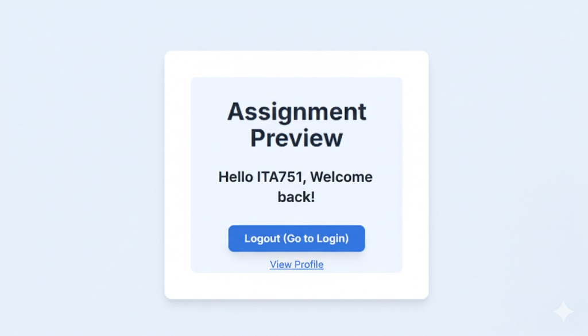

# DevOps Assignment - Yash Patil

## Project Overview
This repository contains a complete DevOps pipeline implementation including:
- **Terraform Infrastructure**: AWS EC2 instances for Docker Swarm cluster
- **Ansible Automation**: Configuration management for all nodes
- **Django Application**: Web application with user authentication
- **Docker & Docker Swarm**: Containerization and orchestration
- **Jenkins CI/CD**: Automated build, test, and deployment pipeline

## Architecture
- **Controller Node**: Jenkins server for CI/CD
- **Swarm Manager**: Docker Swarm orchestration
- **Worker Nodes**: Application containers (2x t2.micro)
- **Database**: PostgreSQL container

## Technologies Used
- **Infrastructure**: Terraform, AWS EC2
- **Configuration**: Ansible
- **Application**: Django, PostgreSQL
- **Containerization**: Docker, Docker Swarm
- **CI/CD**: Jenkins Pipeline
- **Cloud**: AWS (Spot Instances for cost optimization)

## Student Information
- **Name**: Yash D. Patil
- **Student ID**: A751
- **Email**: yashpa22it@student.mes.ac.in
- **Course**: DevOps Assignment

## Setup Instructions
1. Configure AWS credentials
2. Update Terraform variables
3. Run `terraform init && terraform apply`
4. Configure Jenkins with provided pipeline
5. Deploy application via Jenkins

## Features Implemented
- ✅ Infrastructure as Code (Terraform)
- ✅ Configuration Management (Ansible)
- ✅ Container Orchestration (Docker Swarm)
- ✅ CI/CD Pipeline (Jenkins)
- ✅ Web Application (Django)
- ✅ Database Integration (PostgreSQL)
- ✅ Cost Optimization (Spot Instances)

## Application Output

### User Registration Interface

### Assignment Preview Dashboard

The Django web application includes:

1. **Registration Page**: Modern UI with frosted glass design for user account creation
2. **Dashboard**: Personalized welcome interface showing assignment preview
3. **Authentication**: Secure login/logout functionality
4. **Profile Management**: User profile viewing capabilities

